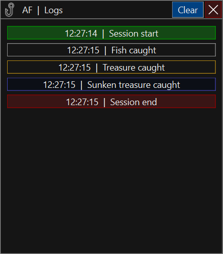

# Auto fishing for Roblox Arcane Odyssey

## How to install it
Go to the desired folder using the console
Download the repository

```sh

```sh
git clone https://github.com/Zombie-220/Fishing.git
cd Fishing/dist
```

```

Here is the main.exe file we need. let's launch it

```sh

```sh
main.exe
```
```

## What does this application do
The application is designed for automatic fishing in Roblox Arcane Odyssey
---
## What is included in the application

Main window


Logs window


Setting window


---
## coming soon
I'm too lazy to write everything now...